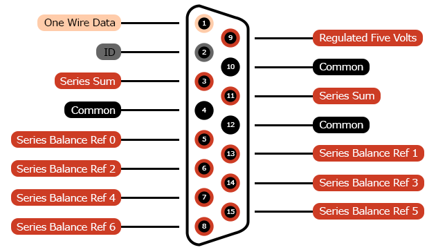

# Enhanced Battery Connector

DA-15 connectors were commonly used by consumers to connect joysticks and
other peripherals to traditional computers. Since these are rarely found in
modern computing, the connectors are prime candidates for re-specification.

The Retro Modules "Enhanced Battery Connector" can be used with Battery
Management Systems & similar devices. The typical series battery pack is just
that: a simple set of batteries [wired in series](../../terms/power/series)
with some extra wires for monitoring things. This is pretty much the least
expensive way to manufacture battery packs. Hobbyists typically prefer this
approach due to price & access to the raw components within the battery pack.
This connector is meant to be a very affordable complement to these battery
packs.

The idea is that you would be able to connect your battery to your charge
controller & the charge controller would _load a preset_ based on the
[multi-cell battery resistor matrix](../../terms/power/multi-cell-battery-resistor-matrix).
The Enhanced Battery Connector supports up to six batteries wired in series
(e.g. 1S, 2S, 3S, 4S, 5S & 6S battery packs).

## Examples
* 1S LiPo battery pack:
    * 1K Ohm resistor
* 6S Pb battery pack (e.g. a 12V lead acid battery):
    * 1.6 Ohm resistor
* 6S LiIo battery pack:
    * 160 Ohm resistor
* 6S LiPo battery pack:
    * 1.6K Ohm resistor

## Contacts

1. [io-one-wire-data](../../terms/communication-standards/digital/one-wire)
2. [io-battery-pack-id](../../terms/communication-standards/analog/battery-pack-id)
3. [series-sum](../../terms/power/series/sum)
4. [common](../../terms/common)
5. [series-balance-ref-0](../../terms/power/series/balance-reference)
6. [series-balance-ref-2](../../terms/power/series/balance-reference)
7. [series-balance-ref-4](../../terms/power/series/balance-reference)
8. [series-balance-ref-6](../../terms/power/series/balance-reference)
9. [regulated-five-volts](../../terms/power/bus/regulated-five-volts)
10. [io-common](../../terms/common/io)
11. [series-sum](../../terms/power/series/sum)
12. [common](../../terms/common)
13. [series-balance-ref-1](../../terms/power/series/balance-reference)
14. [series-balance-ref-3](../../terms/power/series/balance-reference)
15. [series-balance-ref-5](../../terms/power/series/balance-reference)

## Recommendations
* [Current](../../recommendations/power/current)

## Compatible Connectors
Connectors that have the exact same contact specification.

* [Card Edge 16](../card-edge-16)
* [2x8 Header with Key at Position 16](../header-2x8k16)

## Compatible Cables
* [DA-15 Extension Cable](../../cables/dsub-da-15)
* [15 Contact IDC Ribbon Cable](../../cables/idc-ribbon-15)

## Related Tutorials
Coming soon!

## Related Projects
Coming soon!

## Aliases
* DB-15
* D-sub 15
