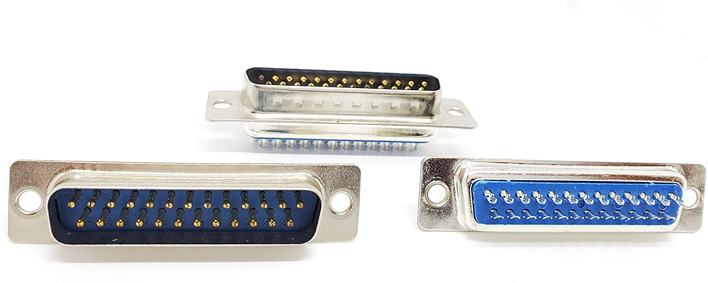
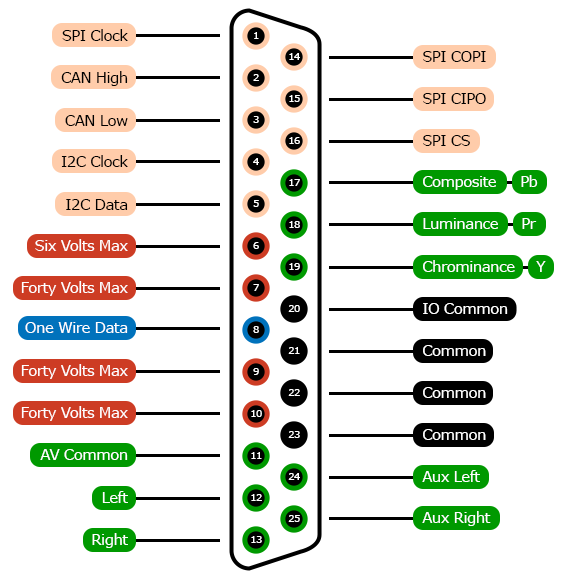

# DB-25 Connector

DB25 connectors were commonly used by consumers to connect
printers, modems and other larger peripherals to traditional
computers. They are often used by legacy point-of-sale systems.
Since these are rarely found in modern computing, the connectors
are prime candidates for re-specification.

Please click [here](models) to view 3D models related to this connector.

Please click [here](contrib) for more info about how this connector
is used elsewhere.

## Contacts

1. [io-spi-clock](../../terms/communication-standards/digital/spi)
2. [io-controller-area-network-high](../../terms/communication-standards/digital/canbus)
3. [io-controller-area-network-low](../../terms/communication-standards/digital/canbus)
4. [io-i2c-clock](../../terms/communication-standards/digital/i2c)
5. [io-i2c-data](../../terms/communication-standards/digital/i2c)
6. [six-volts-max](../../terms/power/bus/six-volts-max)
7. [forty-volts-max](../../terms/power/bus/forty-volts-max)
8. [io-one-wire-data](../../terms/communication-standards/digital/one-wire)
9. [forty-volts-max](../../terms/power/bus/forty-volts-max)
10. [forty-volts-max](../../terms/power/bus/forty-volts-max)
11. [av-bus-common](../../terms/common/av)
12. 
    * [av-bus-audio-line-level-left](../../terms/audio/analog/line-level)
    * [av-bus-audio-line-level-aux-send-1](../../terms/audio/analog/line-level)
    * [av-bus-audio-line-level-channel-1](../../terms/audio/analog/line-level)
13. 
    * [av-bus-audio-line-level-right](../../terms/audio/analog/line-level)
    * [av-bus-audio-line-level-aux-send-2](../../terms/audio/analog/line-level)
    * [av-bus-audio-line-level-channel-2](../../terms/audio/analog/line-level)
14. [io-spi-controller-out-peripheral-in](../../terms/communication-standards/digital/spi)
15. [io-spi-controller-in-peripheral-out](../../terms/communication-standards/digital/spi)
16. [io-spi-chip-select](../../terms/communication-standards/digital/spi)
17. 
    * [av-bus-video-composite](../../terms/video/analog/composite)
    * [av-bus-video-component-pb](../../terms/video/analog/component)
    * [common](../../terms/common)
18. 
    * [av-bus-video-separate-luminance](../../terms/video/analog/separate)
    * [av-bus-video-component-pr](../../terms/video/analog/component)
    * [common](../../terms/common)
19. 
    * [av-bus-video-separate-chrominance](../../terms/video/analog/separate)
    * [av-bus-video-component-y](../../terms/video/analog/component)
    * [common](../../terms/common)
20. [io-common](../../terms/common/io)
21. [common](../../terms/common)
22. [common](../../terms/common)
23. [common](../../terms/common)
24. 
    * [av-bus-audio-line-level-aux-left](../../terms/audio/analog/line-level)
    * [av-bus-audio-line-level-aux-return-1](../../terms/audio/analog/line-level)
    * [av-bus-audio-line-level-channel-3](../../terms/audio/analog/line-level)
    * [av-bus-audio-line-level-channel-1-phase-inverted](../../terms/audio/analog/line-level)
    * [common](../../terms/common)
25. 
    * [av-bus-audio-line-level-aux-right](../../terms/audio/analog/line-level)
    * [av-bus-audio-line-level-aux-return-2](../../terms/audio/analog/line-level)
    * [av-bus-audio-line-level-channel-4](../../terms/audio/analog/line-level)
    * [av-bus-audio-line-level-channel-2-phase-inverted](../../terms/audio/analog/line-level)
    * [common](../../terms/common)

## Capabilities
* [DC Power](../../terms/power/direct-current)
* [Analog HD Video](../../terms/video/analog/hd)
* [Analog SD Video](../../terms/video/analog/sd)
* [Analog Line Level Audio](../../terms/audio/analog/line-level)
* [One-Wire Data](../../terms/communication-standards/digital/one-wire)
* [CAN bus](../../terms/communication-standards/digital/canbus)
* [SPI bus](../../terms/communication-standards/digital/spi)
* [I2C bus](../../terms/communication-standards/digital/i2c)
* [ICSP](../../terms/communication-standards/digital/icsp)

## Recommendations
* [Current](../../recommendations/power/current)

## Compatible Connectors
Connectors that have the exact same contact specification.

* [Card Edge 26](../card-edge-26)
* [2x13 Header with Key at Position 26](../header-2x13k26)

## Compatible Cables
* [DB-25 Extension Cable](../../cables/dsub-db-25)
* [DB-25 Printer Cable](../../cables/dsub-db-25-printer)
* [25 Contact IDC Ribbon Cable](../../cables/idc-ribbon-25)

## Related Connectors
Connectors that are commonly used with this connector.

* [DE-9](../dsub-de-9)
* [2x5 Header with Key at Position 10](../header-2x5k10)
* [Card Edge 10](../card-edge-10)
* [IDC Connector](../../terms/connectors/idc)

## Related Adapters
Adapters that are commonly used with this connector.

* [DB-25 to DE-9](../../adapters/dsub-db-25-dsub-de-9)

## Related Tutorials
Coming soon!

## Related Projects
Coming soon!

## Details
### Requirements
* Must be pin-compatible with off-the-shelf [DE9 to DB25 adapters](../../adapters/dsub-db-25-dsub-de-9).
* Contacts 18 through 25 must be dead-short tolerant.
  Some printer cables tie these pins to [common](../../terms/common).

### Aliases
* D-sub 25
* Parallel Port
* Printer Port
