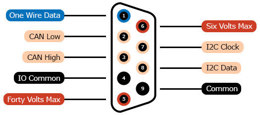

# DE-9 Connector

Commonly referred to as DB-9, DE-9 connectors were commonly used
by consumers to connect modems, mice and other small peripherals
to traditional computers. They are often used by professionals
who wish to utilize the older RS-232 or RS-422 protocols.
Since these are rarely found in modern computing, the connectors
are prime candidates for re-specification.

## Contacts

1. [io-one-wire-data](../../terms/communication-standards/digital/one-wire)
2. [io-controller-area-network-low](../../terms/communication-standards/digital/canbus)
3. [io-controller-area-network-high](../../terms/communication-standards/digital/canbus)
4. [io-common](../../terms/common)
5. [forty-volts-max](../../terms/power/bus/forty-volts-max)
6. [six-volts-max](../../terms/power/bus/six-volts-max)
7. [io-i2c-clock](../../terms/communication-standards/digital/i2c)
8. [io-i2c-data](../../terms/communication-standards/digital/i2c)
9. [common](../../terms/common)

## Recommendations
* [Current](../../recommendations/power/current)

## Compatible Connectors
Connectors that have the exact same contact specification.

* [Card Edge 10](../card-edge-10)
* [2x5 Header with Key at Position 10](../header-2x5k10)

## Compatible Cables
* [DE-9 Extension Cable](../../cables/dsub-db-25)
* [10 Contact IDC Ribbon Cable](../../cables/idc-ribbon-9)

## Related Connectors
Connectors that are commonly used with this connector.

* [DB-25](../dsub-db-25)
* [2x13 Header with Key at Position 26](../header-2x13k26)
* [Card Edge 26](../card-edge-26)

## Related Adapters
Adapters that are commonly used with this connector.

* [DB-25 to DE-9](../../adapters/dsub-db-25-dsub-de-9)

## Related Tutorials
Coming soon!

## Related Projects
Coming soon!

## Aliases
* DB-9
* Dsub 9
