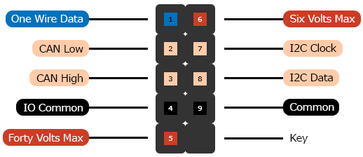

# 2x5 Header with Key at Position 10
The companion header for the [DE-9](../dsub-de-9) connector.

## Contacts

1. [io-one-wire-data](../../terms/communication-standards/digital/one-wire)
2. [io-controller-area-network-low](../../terms/communication-standards/digital/canbus)
3. [io-controller-area-network-high](../../terms/communication-standards/digital/canbus)
4. [io-common](../../terms/common)
5. [forty-volts-max](../../terms/power/bus/forty-volts-max)
6. [six-volts-max](../../terms/power/bus/six-volts-max)
7. [io-i2c-clock](../../terms/communication-standards/digital/i2c)
8. [io-i2c-data](../../terms/communication-standards/digital/i2c)
9. [common](../../terms/common)

## Keys
To help ensure proper connection, a [polarizing key](../../terms/connectors/socket/polarizing-key) should be inserted
into position 10 of related sockets.

## Recommendations
* [Current](../../recommendations/power/current)

## Compatible Connectors
Connectors that have the exact same contact specification.

* [DE-9](../dsub-de-9)
* [Card Edge 10](../card-edge-10)

## Compatible Cables
* [DE-9 Extension Cable](../../cables/dsub-db-25)
* [10 Contact IDC Ribbon Cable](../../cables/idc-ribbon-9)
