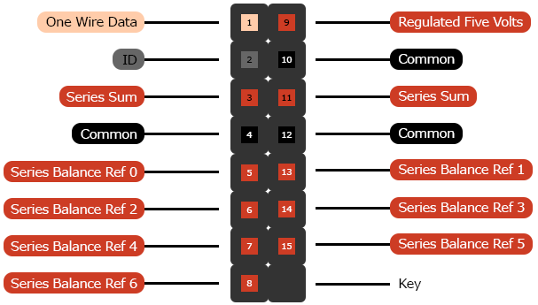

# Enhanced Battery Header
The companion header for the [Enhanced Battery Connector](../dsub-da-15).

## Contacts

1. [io-one-wire-data](../../terms/communication-standards/digital/one-wire)
2. [io-battery-pack-id](../../terms/communication-standards/analog/battery-pack-id)
3. [series-sum](../../terms/power/series/sum)
4. [common](../../terms/common)
5. [series-balance-ref-0](../../terms/power/series/balance-reference)
6. [series-balance-ref-2](../../terms/power/series/balance-reference)
7. [series-balance-ref-4](../../terms/power/series/balance-reference)
8. [series-balance-ref-6](../../terms/power/series/balance-reference)
9. [regulated-five-volts](../../terms/power/bus/regulated-five-volts)
10. [io-common](../../terms/common/io)
11. [series-sum](../../terms/power/series/sum)
12. [common](../../terms/common)
13. [series-balance-ref-1](../../terms/power/series/balance-reference)
14. [series-balance-ref-3](../../terms/power/series/balance-reference)
15. [series-balance-ref-5](../../terms/power/series/balance-reference)

## Keys
To help ensure proper connection, a [polarizing key](../../terms/connectors/socket/polarizing-key) should be inserted
into position 16 of related sockets.

## Recommendations
* [Current](../../recommendations/power/current)
