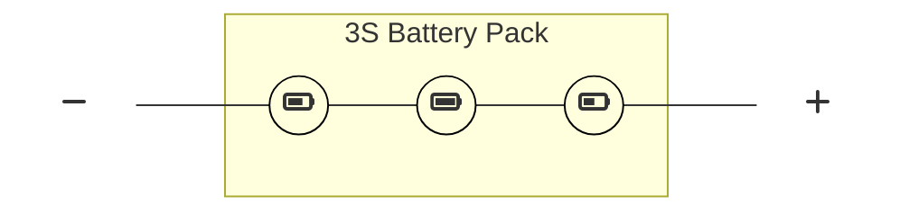

Enhanced Battery Connector
==========================

The typical series battery pack is just that: a simple set of batteries [wired
in series](https://en.wikipedia.org/wiki/Series_and_parallel_circuits#Series_circuits)
with some extra wires for monitoring things. This is pretty much the least
expensive way to manufacture batteries. Hobbyists prefer this approach due to
price & access to the raw components within the battery pack.

This connector is meant to be a very affordable complement to these batteries.

The idea is that you would be able to connect your battery to your charge
controller & the charge controller would load a preset based on the
[multi-cell battery resistor matrix](../../../definitions/multi-cell-battery-resistor-matrix.md).
The Enhanced Battery Connector supports up to ten batteries wired in series
(e.g. 3S, 4S, 6S, 10S battery packs, etc). Have a 20S battery? Just use two
Enhanced Battery Connectors & two charge controllers. It can also be used with
a what is typically referred to as a single-cell battery, such as a Lead Acid
12V car battery (which is actually a set of 6x +/- 2VDC cells connected in series).

Details
-------
Please refer to the [spec](../../../connectors/module-internal/header-16/header-16.yaml) for more.
